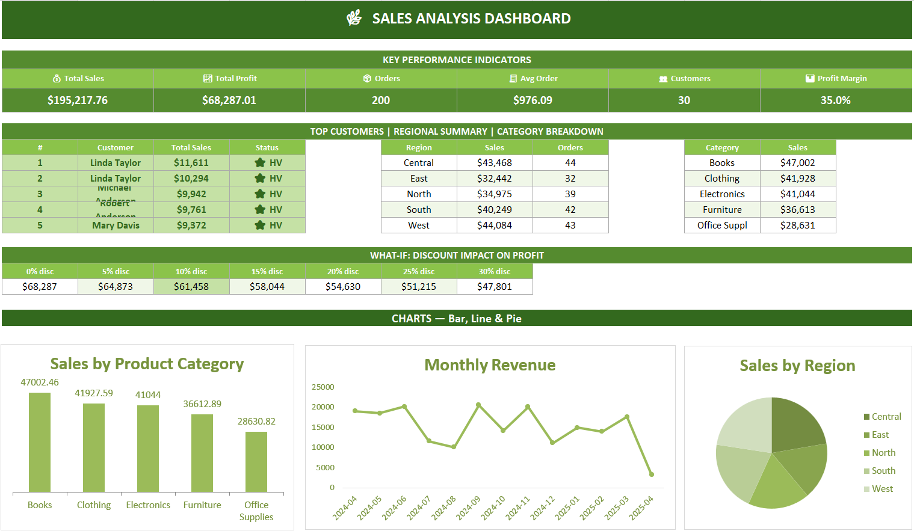

# 🌿 Sales Analysis Dashboard — PR2 Analyzer


> 📊 **A complete Excel-based Sales Analysis project covering 200 orders across 30 customers and 5 regions — featuring KPI tracking, pivot tables, descriptive statistics, customer segmentation, and an interactive dashboard.**

---

## 🖥️ Dashboard Preview



> *Interactive Excel dashboard showing KPIs, Sales by Category, Monthly Revenue trend, and Regional Sales breakdown.*

---

## 📁 Project Structure

```
PR2_Analyzer/
│
├── 📊 PR2_Analyzer.xlsx        # Main workbook — all sheets below
│   ├── 🗂️  Dataset             # Raw data — 200 sales records
│   ├── 📈  Analysis            # Top 10 & High-Value customer analysis
│   ├── 📉  Descriptive Stats   # Data Analysis Toolpak statistics
│   ├── 🔢  Pivot Table         # Sales by Region × Category + Monthly revenue
│   └── 🖥️  Dashboard          # KPI cards + 3 charts
│
├── 🖼️  Dashboard_Sales.png     # Dashboard screenshot
└── 📖  README.md               # Project documentation (this file)
```

---

## 🗃️ Dataset Overview

| Field | Description |
|---|---|
| `Customer_ID` | Unique customer identifier (e.g., CUST015) |
| `Customer_Name` | Full name of the customer |
| `Region` | Sales region — Central, East, North, South, West |
| `Product_Category` | Books, Clothing, Electronics, Furniture, Office Supplies |
| `Sales` | Revenue generated per order ($) |
| `Quantity` | Number of units sold |
| `Discount` | Discount applied (0 to 1 scale) |
| `Order_Date` | Date of the order |
| `Profit` | Profit earned per order ($) |

- **Total Records:** 200 orders
- **Customers:** 30 unique
- **Categories:** 5 product categories
- **Regions:** 5 (Central, East, North, South, West)
- **Period:** April 2024 – April 2025

---

## 📊 Sheets Breakdown

### 1️⃣ Dataset
Raw transactional data with 200 rows and 9 columns. Forms the base for all analysis.

### 2️⃣ Analysis
Customer-level analysis using Excel formulas:

**Top 10 Customers — by Total Sales (COUNTIF / SUMIF + Conditional Formatting)**

| Rank | Customer ID | Name | Region | Total Sales |
|---|---|---|---|---|
| 1 | CUST015 | Linda Taylor | North | $11,611.06 |
| 2 | CUST028 | Linda Taylor | East | $10,293.87 |
| 3 | CUST007 | Michael Anderson | North | $9,941.88 |
| 4 | CUST008 | Robert Anderson | South | $9,760.80 |
| 5 | CUST026 | Mary Davis | East | $9,371.81 |

**High-Value Customers — Groupby / INDEX / MATCH**
- Threshold: Sales ≥ $8,236 (top 25%)
- 8 out of 30 customers qualify as High-Value
- CUST004 has the highest average order value at **$1,116**

### 3️⃣ Descriptive Statistics
Generated using **Excel Data Analysis Toolpak** across 4 fields: Sales, Profit, Quantity, Discount.

### 4️⃣ Pivot Table
**Sales by Region × Product Category**

| Region | Books | Clothing | Electronics | Furniture | Office Supplies | **Total** |
|---|---|---|---|---|---|---|
| Central | $11,297 | $12,200 | $6,621 | $4,877 | $8,473 | **$43,468** |
| East | $11,389 | $2,401 | $2,870 | $7,592 | $8,189 | **$32,442** |
| North | $8,037 | $8,423 | $8,192 | $6,978 | $3,346 | **$34,975** |
| South | $9,588 | $8,394 | $11,989 | $7,983 | $2,295 | **$40,249** |
| West | $6,691 | $10,509 | $11,372 | $9,183 | $6,328 | **$44,084** |
| **GRAND TOTAL** | **$47,002** | **$41,928** | **$41,044** | **$36,613** | **$28,631** | **$1,95,218** |

### 5️⃣ Dashboard
Interactive dashboard with:
- 6 KPI cards (Total Sales, Total Profit, Orders, Avg Order, Customers, Profit Margin)
- Bar chart — Sales by Product Category
- Line chart — Monthly Revenue Trend
- Pie chart — Sales by Region

---

## 📈 Key Performance Indicators

| KPI | Value |
|---|---|
| 💰 Total Sales | $1,95,217.76 |
| 🏆 Total Profit | $68,287.01 |
| 📦 Total Orders | 1,999 units |
| 🧾 Avg Order Value | $976.09 |
| 👥 Unique Customers | 30 |
| 📊 Profit Margin | 34.98% |

---

## 💡 Key Insights

| # | Insight |
|---|---|
| 🥇 | **CUST015** is the #1 revenue driver — $11,611 in total sales across 11 orders (5.9% of all revenue from one customer) |
| 👥 | Top 10 customers together account for the **majority of all business revenue** |
| 💎 | Only **8 of 30 customers (top 25%)** qualify as High-Value (sales ≥ $8,236) — classic 80/20 pattern |
| 🧾 | **CUST004** has the highest average order value at **$1,116** — most valuable per transaction |
| 📚 | **Books** leads in total sales ($47,002 — 24% share) but **Clothing** delivers the highest profit margin at **44.8%** |
| 🌍 | **West region** leads total sales at $44,083 (22.6% share), narrowly ahead of Central ($43,468) |
| 🏦 | **Central region** is the most profitable in absolute terms — $16,068 total profit, 37% margin |
| 📅 | **September 2024** was the peak month ($20,533) with a massive **+103.5% growth** from August |
| 🎯 | **Central × Clothing** ($12,200) and **South × Electronics** ($11,989) are the top region-category combos — ideal for focused marketing |

---

## 🛠️ Tools & Techniques Used

| Tool / Feature | Purpose |
|---|---|
| SUMIF / COUNTIF | Customer sales aggregation |
| INDEX / MATCH | High-value customer lookup |
| Pivot Tables | Region × Category cross-analysis |
| Data Analysis Toolpak | Descriptive statistics (mean, median, std dev) |
| Conditional Formatting | Top 10 customer highlighting |
| Charts & Dashboard | Bar, Line & Pie visualisations |

---

## 🚀 How to Use

1. **Download** `PR2_Analyzer.xlsx`
2. Open in **Microsoft Excel** (2016 or later recommended)
3. Navigate to the **Dashboard** sheet for the full summary view
4. Explore individual sheets — **Dataset → Analysis → Descriptive Stats → Pivot Table**
5. To refresh pivot tables: Right-click any pivot → **Refresh**

---

<br>

---

*Made with 💚 and data · Sales Analysis Dashboard · 2024–2025*

[](https://github.com/)
